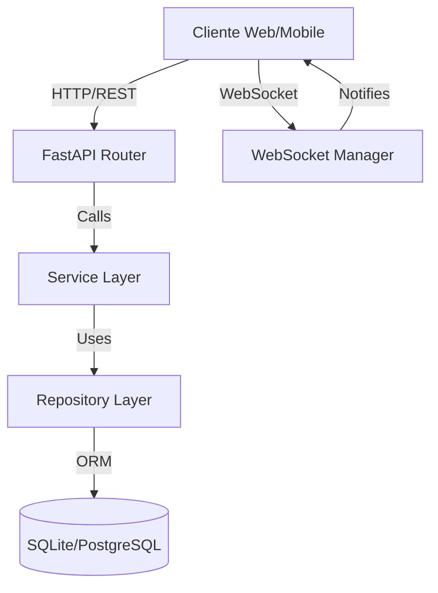
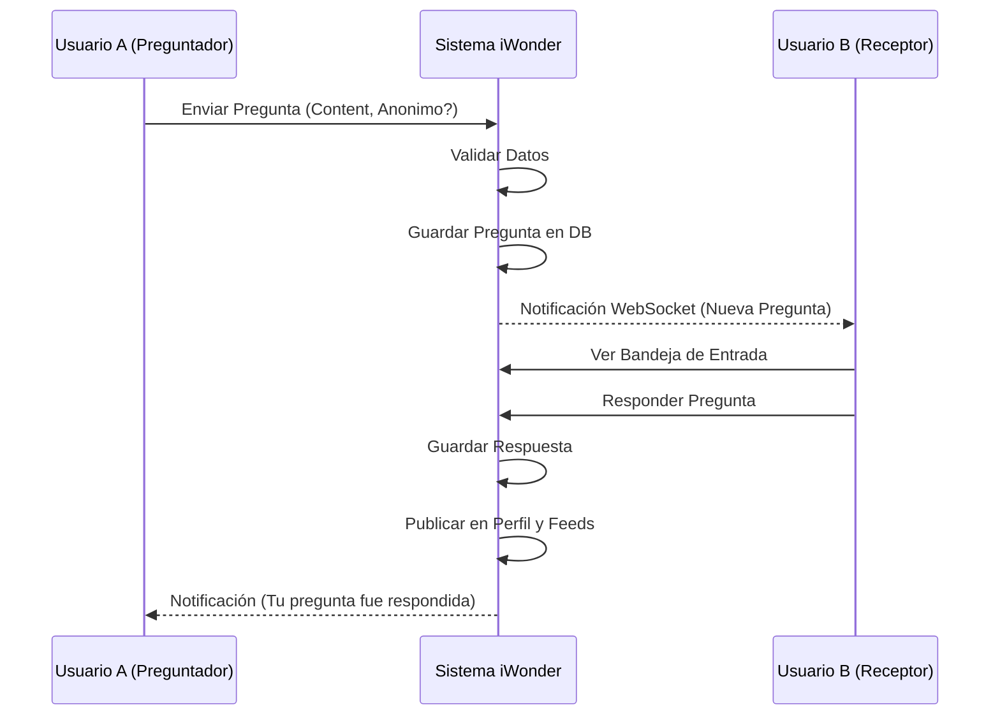

# Documentación Técnica del Sistema iWonder

## 1. Descripción del Sistema

### 1.1 Propósito y Objetivos
**iWonder** es una plataforma social de preguntas y respuestas ("Q&A") diseñada para fomentar la interacción entre usuarios a través de la curiosidad. El objetivo principal es permitir a los usuarios realizar preguntas (de forma anónima o pública) a otros usuarios, quienes pueden responderlas y compartirlas en su perfil.

**Objetivos Específicos:**
- Facilitar la comunicación abierta y anónima entre usuarios.
- Crear un "feed" de contenido relevante basado en las personas que el usuario sigue.
- Proveer una API robusta y escalable para soportar clientes web y móviles.

### 1.2 Casos de Uso Principales
1.  **Registro e Inicio de Sesión**: Los usuarios pueden crear cuentas y autenticarse.
2.  **Realizar Pregunta**: Un usuario envía una pregunta a otro (opcionalmente anónima).
3.  **Responder Pregunta**: El receptor responde la pregunta, haciéndola pública.
4.  **Seguir Usuarios**: Los usuarios pueden seguir a otros para ver sus respuestas en el feed.
5.  **Ver Feed**: Visualización cronológica de respuestas de usuarios seguidos.
6.  **Notificaciones en Tiempo Real**: Recepción de alertas cuando se recibe una pregunta (vía WebSockets).

---

## 2. Guía de Instalación y Configuración (Entorno Local)

### 2.1 Prerrequisitos de Software
- **Python**: Versión 3.9 o superior.
- **Git**: Para clonar el repositorio.
- **Virtualenv** (opcional pero recomendado): Para aislar dependencias.

### 2.2 Pasos de Instalación

1.  **Clonar el repositorio**:
    ```bash
    git clone <url-del-repositorio>
    cd iWonder
    ```

2.  **Crear y activar entorno virtual**:
    *   Windows:
        ```bash
        python -m venv venv
        .\venv\Scripts\activate
        ```
    *   Linux/Mac:
        ```bash
        python3 -m venv venv
        source venv/bin/activate
        ```

3.  **Instalar dependencias**:
    ```bash
    cd back
    pip install -r requirements.txt
    ```

4.  **Configuración de Variables de Entorno**:
    El sistema utiliza una configuración por defecto, pero para producción se recomienda crear un archivo `.env` en la carpeta `back/` con:
    ```ini
    SECRET_KEY=tu_clave_secreta_segura
    ALGORITHM=HS256
    ACCESS_TOKEN_EXPIRE_MINUTES=30
    ```

5.  **Inicializar Base de Datos**:
    El sistema utiliza SQLite por defecto. Al iniciar la aplicación, las tablas se crean automáticamente vía SQLAlchemy (`models.Base.metadata.create_all`).
    Para migraciones con Alembic:
    ```bash
    alembic upgrade head
    ```

6.  **Ejecutar el Servidor**:
    ```bash
    uvicorn main:app --reload
    ```
    El servidor iniciará en `http://localhost:8000`.
    La documentación interactiva (Swagger) estará disponible en `http://localhost:8000/docs`.

---

## 3. Arquitectura Técnica

### 3.1 Diagrama de Componentes


### 3.2 Tecnologías Utilizadas
-   **Lenguaje**: Python 3.
-   **Framework Web**: FastAPI (Alto rendimiento, asíncrono).
-   **ORM**: SQLAlchemy (Mapeo Objeto-Relacional).
-   **Migraciones**: Alembic.
-   **Base de Datos**: SQLite (Desarrollo), PostgreSQL (Recomendado Producción).
-   **Autenticación**: JWT (JSON Web Tokens) con `python-jose` y `passlib`.
-   **Tiempo Real**: WebSockets nativos de FastAPI.

### 3.3 Patrón de Diseño
El sistema implementa una **Arquitectura en Capas (Layered Architecture)** para separar responsabilidades:
1.  **Routers/API Layer** (`back/api`, `back/routers`): Maneja las peticiones HTTP, validación de entrada (Pydantic) y respuestas.
2.  **Service Layer** (`back/application/services`): Contiene la lógica de negocio pura (ej. orquestar la creación de una pregunta).
3.  **Repository Layer** (`back/infrastructure/repositories`): Abstrae el acceso a datos. Contiene las consultas SQL/ORM.
4.  **Domain/Models** (`back/domain`, `back/infrastructure/db/models.py`): Define las entidades de datos y esquemas.

---

## 4. Documentación del Algoritmo Principal

### 4.1 Generación del Feed de Noticias
El núcleo de la experiencia social es el "Feed", que muestra las respuestas más recientes de los usuarios seguidos.

**Propósito**: Recuperar una lista paginada de respuestas generadas por los usuarios que el usuario actual sigue.

**Pseudocódigo**:
```python
FUNCTION get_feed(current_user_id, page, limit):
    # Paso 1: Obtener lista de IDs de usuarios seguidos
    following_relations = DB.query(FollowTable)
                          .WHERE(follower_id == current_user_id)
    
    followed_ids = [rel.followed_id FOR rel IN following_relations]
    
    IF followed_ids IS EMPTY:
        RETURN []
        
    # Paso 2: Consultar respuestas filtrando por autores seguidos
    answers = DB.query(AnswerTable)
              .WHERE(author_id IN followed_ids)
              .ORDER_BY(created_at DESCENDING)
              .OFFSET(page * limit)
              .LIMIT(limit)
              
    RETURN answers
```

**Complejidad Computacional**:
-   **Tiempo**: $O(F + log(A) + K)$, donde $F$ es el número de seguidos, $A$ es el total de respuestas (indexado), y $K$ es el tamaño de la página (`limit`). La búsqueda en base de datos con índices es eficiente.
-   **Casos de Prueba**:
    1.  Usuario no sigue a nadie -> Retorna lista vacía.
    2.  Usuario sigue a A (sin respuestas) -> Retorna lista vacía.
    3.  Usuario sigue a B (con respuestas) -> Retorna respuestas de B ordenadas por fecha.
    4.  Paginación -> Verificar que `skip=10` trae los siguientes resultados.

---

## 5. Diagrama de Flujo del Proceso de Negocio (Pregunta-Respuesta)



---

## 6. Especificación de Requerimientos

### 6.1 Requerimientos Funcionales
| ID | Historia de Usuario | Criterios de Aceptación |
|----|---------------------|-------------------------|
| RF01 | Como usuario, quiero registrarme para tener una cuenta. | Email único, pass hasheado. |
| RF02 | Como usuario, quiero preguntar anónimamente. | Opción "Anónimo" oculta mi ID. |
| RF03 | Como usuario, quiero seguir a otros. | Botón seguir, actualiza feed. |
| RF04 | Como usuario, quiero ver mi feed. | Lista cronológica de respuestas de seguidos. |

### 6.2 Requerimientos No Funcionales
1.  **Seguridad**:
    *   Passwords almacenados con Bcrypt.
    *   Tokens JWT para sesión stateless.
    *   CORS configurado para restringir orígenes.
2.  **Rendimiento**:
    *   Tiempo de respuesta API < 200ms para lecturas.
    *   Soporte de paginación en todos los endpoints de listas.
3.  **Escalabilidad**:
    *   Arquitectura Stateless permite escalado horizontal (múltiples réplicas).
4.  **Disponibilidad**:
    *   99.9% uptime objetivo.

---

## 7. Propuesta de Arquitectura de Despliegue en la Nube (Cost-Optimized)

Para minimizar costos utilizando niveles gratuitos (Free Tier), se propone la siguiente arquitectura:

### 7.1 Proveedor: Oracle Cloud Infrastructure (OCI) Always Free
Oracle ofrece una de las capas gratuitas más generosas:
-   **Compute**: Instancia VM.Standard.A1.Flex (ARM) con hasta 4 OCPUs y 24GB de RAM.
-   **Database**: Autonomous Database (20GB) o correr PostgreSQL/MySQL en Docker dentro de la VM.

### 7.2 Estrategia de Despliegue
1.  **Containerización**: Empaquetar la aplicación `back` en una imagen Docker.
2.  **Orquestación**: Usar `Docker Compose` en la VM para levantar:
    -   Contenedor `app` (FastAPI).
    -   Contenedor `db` (PostgreSQL - más robusto que SQLite).
    -   Contenedor `nginx` (Reverse Proxy & SSL Termination con Certbot).
3.  **CI/CD**: GitHub Actions para construir la imagen Docker y desplegarla vía SSH a la VM al hacer push a `main`.

### 7.3 Monitoreo y Mantenimiento
-   **Logs**: Configurar rotación de logs en Docker.
-   **Monitoreo Básico**: Usar **Uptime Kuma** (Open Source, self-hosted en la misma VM) para monitorear el endpoint de salud (`/`).
-   **Backups**: Script cron diario para `pg_dump` de la base de datos subido a un bucket S3 (AWS Free Tier 5GB) o Google Drive.
